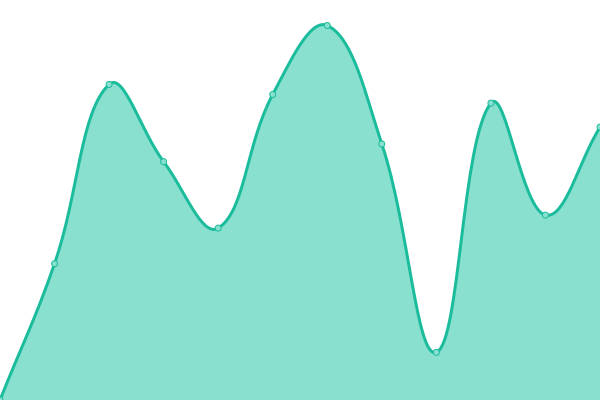

# [📈 Live Status](https://Avrean-Srl.github.io/redergo-upptime): <!--live status--> **🟧 Partial outage**

This repository contains the open-source uptime monitor and status page for [Syndra Labs](https://syndra.io), powered by [Upptime](https://github.com/upptime/upptime).

With [Upptime](https://upptime.js.org), you can get your own unlimited and free uptime monitor and status page, powered entirely by a GitHub repository. We use [Issues](https://github.com/Avrean-Srl/redergo-upptime/issues) as incident reports, [Actions](https://github.com/Avrean-Srl/redergo-upptime/actions) as uptime monitors, and [Pages](https://Avrean-Srl.github.io/redergo-upptime) for the status page.

<!--start: status pages-->
<!-- This summary is generated by Upptime (https://github.com/upptime/upptime) -->
<!-- Do not edit this manually, your changes will be overwritten -->
<!-- prettier-ignore -->
| URL | Status | History | Response Time | Uptime |
| --- | ------ | ------- | ------------- | ------ |
|  [Redergo](https://redergo.com) | 🟩 Up | [redergo.yml](https://github.com/Avrean-Srl/redergo-upptime/commits/HEAD/history/redergo.yml) | 

 673ms
     
 | 

<a href="https://Avrean-Srl.github.io/redergo-upptime/history/redergo">100.00%</a>
    

|  [Consorzio Vad쑇(https://consorziovado.com) | 🟩 Up | [consorzio-vado.yml](https://github.com/Avrean-Srl/redergo-upptime/commits/HEAD/history/consorzio-vado.yml) | 

 804ms
     
 | 

<a href="https://Avrean-Srl.github.io/redergo-upptime/history/consorzio-vado">100.00%</a>
    

|  [Sasp](https://www.arrampicata.com) | 🟩 Up | [sasp.yml](https://github.com/Avrean-Srl/redergo-upptime/commits/HEAD/history/sasp.yml) | 

 441ms
     
 | 

<a href="https://Avrean-Srl.github.io/redergo-upptime/history/sasp">100.00%</a>
    

|  [4foodies](http://4foodies.it) | 🟩 Up | [4foodies.yml](https://github.com/Avrean-Srl/redergo-upptime/commits/HEAD/history/4foodies.yml) | 

 1535ms
     
 | 

<a href="https://Avrean-Srl.github.io/redergo-upptime/history/4foodies">100.00%</a>
    

|  [Hexaquotes](https://hexaquotes.avrean.net) | 🟩 Up | [hexaquotes.yml](https://github.com/Avrean-Srl/redergo-upptime/commits/HEAD/history/hexaquotes.yml) | 

 778ms
     
 | 

<a href="https://Avrean-Srl.github.io/redergo-upptime/history/hexaquotes">100.00%</a>
    

|  [Consorzio Vad (duplicato corretto)](https://consorziovado.com) | 🟩 Up | [consorzio-vado-duplicato-corretto.yml](https://github.com/Avrean-Srl/redergo-upptime/commits/HEAD/history/consorzio-vado-duplicato-corretto.yml) | 

 589ms
     
 | 

<a href="https://Avrean-Srl.github.io/redergo-upptime/history/consorzio-vado-duplicato-corretto">100.00%</a>
    

|  [4foodies (corretto)](https://www.4foodies.it) | 🟩 Up | [4foodies-corretto.yml](https://github.com/Avrean-Srl/redergo-upptime/commits/HEAD/history/4foodies-corretto.yml) | 

 1056ms
     
 | 

<a href="https://Avrean-Srl.github.io/redergo-upptime/history/4foodies-corretto">100.00%</a>
    

|  [Algo Group](https://www.algogroup.net) | 🟩 Up | [algo-group.yml](https://github.com/Avrean-Srl/redergo-upptime/commits/HEAD/history/algo-group.yml) | 

 1130ms
     
 | 

<a href="https://Avrean-Srl.github.io/redergo-upptime/history/algo-group">100.00%</a>
    

|  [Alice Scagliola Nutrizionista](https://alicescagliolanutrizionista.com) | 🟩 Up | [alice-scagliola-nutrizionista.yml](https://github.com/Avrean-Srl/redergo-upptime/commits/HEAD/history/alice-scagliola-nutrizionista.yml) | 

 189ms
     
 | 

<a href="https://Avrean-Srl.github.io/redergo-upptime/history/alice-scagliola-nutrizionista">100.00%</a>
    

|  [Images Algo](https://images.algo.it) | 🟩 Up | [images-algo.yml](https://github.com/Avrean-Srl/redergo-upptime/commits/HEAD/history/images-algo.yml) | 

 1223ms
     
 | 

<a href="https://Avrean-Srl.github.io/redergo-upptime/history/images-algo">100.00%</a>
    

|  [Foto Attualit Cesni](https://fotoattualitacesni.com) | 🟩 Up | [foto-attualita-cesni.yml](https://github.com/Avrean-Srl/redergo-upptime/commits/HEAD/history/foto-attualita-cesni.yml) | 

 1365ms
     
 | 

<a href="https://Avrean-Srl.github.io/redergo-upptime/history/foto-attualita-cesni">100.00%</a>
    

|  [Blugestiam](https://blugestiam.com) | 🟥 Down | [blugestiam.yml](https://github.com/Avrean-Srl/redergo-upptime/commits/HEAD/history/blugestiam.yml) | 

 0ms
     
 | 

<a href="https://Avrean-Srl.github.io/redergo-upptime/history/blugestiam">2.40%</a>
    

|  [Online Service](https://www.onlineservice.it) | 🟩 Up | [online-service.yml](https://github.com/Avrean-Srl/redergo-upptime/commits/HEAD/history/online-service.yml) | 

 4343ms
     
 | 

<a href="https://Avrean-Srl.github.io/redergo-upptime/history/online-service">100.00%</a>
    

|  [Photop](https://photop.it) | 🟩 Up | [photop.yml](https://github.com/Avrean-Srl/redergo-upptime/commits/HEAD/history/photop.yml) | 

 4681ms
     
 | 

<a href="https://Avrean-Srl.github.io/redergo-upptime/history/photop">100.00%</a>
    

|  [Dropper AI](https://www.dropper.ai) | 🟩 Up | [dropper-ai.yml](https://github.com/Avrean-Srl/redergo-upptime/commits/HEAD/history/dropper-ai.yml) | 

 953ms
     
 | 

<a href="https://Avrean-Srl.github.io/redergo-upptime/history/dropper-ai">100.00%</a>
    

|  [Dropper AI Dashboard](https://dashboard.dropper.ai/login) | 🟩 Up | [dropper-ai-dashboard.yml](https://github.com/Avrean-Srl/redergo-upptime/commits/HEAD/history/dropper-ai-dashboard.yml) | 

 633ms
     
 | 

<a href="https://Avrean-Srl.github.io/redergo-upptime/history/dropper-ai-dashboard">100.00%</a>
    

|  [Orologi Aeronautica](https://orologiaeronautica.it) | 🟩 Up | [orologi-aeronautica.yml](https://github.com/Avrean-Srl/redergo-upptime/commits/HEAD/history/orologi-aeronautica.yml) | 

 906ms
     
 | 

<a href="https://Avrean-Srl.github.io/redergo-upptime/history/orologi-aeronautica">100.00%</a>
    

|  [Honpe](https://www.honpe.it) | 🟩 Up | [honpe.yml](https://github.com/Avrean-Srl/redergo-upptime/commits/HEAD/history/honpe.yml) | 

 1400ms
     
 | 

<a href="https://Avrean-Srl.github.io/redergo-upptime/history/honpe">100.00%</a>
    

<!--end: status pages-->

[**Visit our status website →**](https://Avrean-Srl.github.io/redergo-upptime)

## 📄 License

- Powered by: [Upptime](https://github.com/upptime/upptime)
- Code: [MIT](./LICENSE) © [Anand Chowdhary](https://anandchowdhary.com), supported by [Pabio](https://pabio.com)
- Data in the `./history` directory: [Open Database License](https://opendatacommons.org/licenses/odbl/1-0/)
