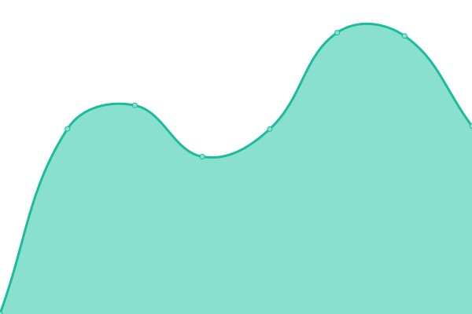
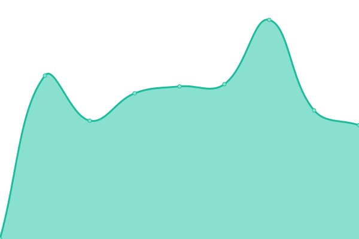
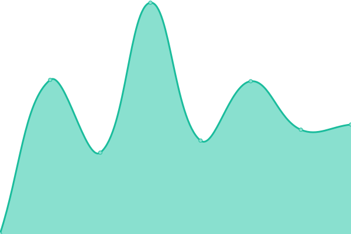
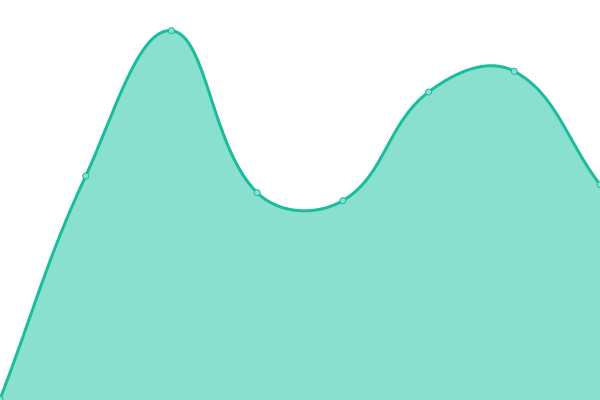
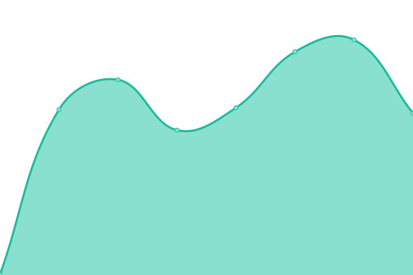
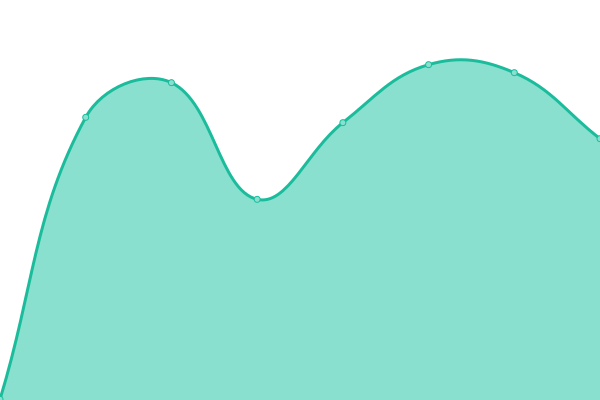
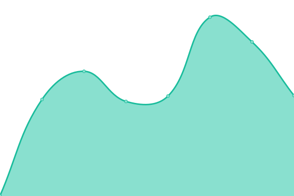
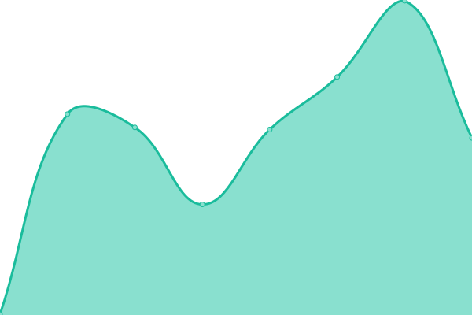
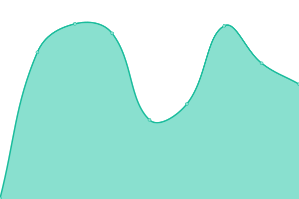

# [📈 Live Status](https://Avrean-Srl.github.io/redergo-upptime): <!--live status--> **🟧 Partial outage**

This repository contains the open-source uptime monitor and status page for [Syndra Labs](https://syndra.io), powered by [Upptime](https://github.com/upptime/upptime).

With [Upptime](https://upptime.js.org), you can get your own unlimited and free uptime monitor and status page, powered entirely by a GitHub repository. We use [Issues](https://github.com/Avrean-Srl/redergo-upptime/issues) as incident reports, [Actions](https://github.com/Avrean-Srl/redergo-upptime/actions) as uptime monitors, and [Pages](https://Avrean-Srl.github.io/redergo-upptime) for the status page.

<!--start: status pages-->
<!-- This summary is generated by Upptime (https://github.com/upptime/upptime) -->
<!-- Do not edit this manually, your changes will be overwritten -->
<!-- prettier-ignore -->
| URL | Status | History | Response Time | Uptime |
| --- | ------ | ------- | ------------- | ------ |
|  [4foodies](https://www.4foodies.it) | 🟩 Up | [4foodies.yml](https://github.com/Avrean-Srl/redergo-upptime/commits/HEAD/history/4foodies.yml) | 

 1269ms
     
 | 

<a href="https://Avrean-Srl.github.io/redergo-upptime/history/4foodies">100.00%</a>
    

|  [Add Skills](https://addskills.it) | 🟩 Up | [add-skills.yml](https://github.com/Avrean-Srl/redergo-upptime/commits/HEAD/history/add-skills.yml) | 

 3520ms
     
 | 

<a href="https://Avrean-Srl.github.io/redergo-upptime/history/add-skills">100.00%</a>
    

|  [Algo Group](https://www.algogroup.net) | 🟩 Up | [algo-group.yml](https://github.com/Avrean-Srl/redergo-upptime/commits/HEAD/history/algo-group.yml) | 

 1071ms
     
 | 

<a href="https://Avrean-Srl.github.io/redergo-upptime/history/algo-group">100.00%</a>
    

|  [Arkema](https://www.arkema.it) | 🟩 Up | [arkema.yml](https://github.com/Avrean-Srl/redergo-upptime/commits/HEAD/history/arkema.yml) | 

 811ms
     
 | 

<a href="https://Avrean-Srl.github.io/redergo-upptime/history/arkema">100.00%</a>
    

|  [Au Petit Bonheur](https://aupetitbonheur.org) | 🟩 Up | [au-petit-bonheur.yml](https://github.com/Avrean-Srl/redergo-upptime/commits/HEAD/history/au-petit-bonheur.yml) | 

 818ms
     
 | 

<a href="https://Avrean-Srl.github.io/redergo-upptime/history/au-petit-bonheur">100.00%</a>
    

|  [Blugestiam](https://blugestiam.com) | 🟩 Up | [blugestiam.yml](https://github.com/Avrean-Srl/redergo-upptime/commits/HEAD/history/blugestiam.yml) | 

 336ms
     
 | 

<a href="https://Avrean-Srl.github.io/redergo-upptime/history/blugestiam">100.00%</a>
    

|  [Bursi](https://bursi.it) | 🟩 Up | [bursi.yml](https://github.com/Avrean-Srl/redergo-upptime/commits/HEAD/history/bursi.yml) | 

 1338ms
     
 | 

<a href="https://Avrean-Srl.github.io/redergo-upptime/history/bursi">100.00%</a>
    

|  [Capone Costruzioni](https://caponecostruzioni.com) | 🟩 Up | [capone-costruzioni.yml](https://github.com/Avrean-Srl/redergo-upptime/commits/HEAD/history/capone-costruzioni.yml) | 

 301ms
     
 | 

<a href="https://Avrean-Srl.github.io/redergo-upptime/history/capone-costruzioni">100.00%</a>
    

|  [Consorzio Terna](https://consorzioterna.it) | 🟩 Up | [consorzio-terna.yml](https://github.com/Avrean-Srl/redergo-upptime/commits/HEAD/history/consorzio-terna.yml) | 

 440ms
     
 | 

<a href="https://Avrean-Srl.github.io/redergo-upptime/history/consorzio-terna">100.00%</a>
    

|  [Consorzio Vad쑇(https://consorziovado.com) | 🟩 Up | [consorzio-vado.yml](https://github.com/Avrean-Srl/redergo-upptime/commits/HEAD/history/consorzio-vado.yml) | 

 5077ms
     
 | 

<a href="https://Avrean-Srl.github.io/redergo-upptime/history/consorzio-vado">80.68%</a>
    

|  [Dropper AI](https://www.dropper.ai) | 🟩 Up | [dropper-ai.yml](https://github.com/Avrean-Srl/redergo-upptime/commits/HEAD/history/dropper-ai.yml) | 

 1088ms
     
 | 

<a href="https://Avrean-Srl.github.io/redergo-upptime/history/dropper-ai">100.00%</a>
    

|  [Dropper AI Dashboard](https://dashboard.dropper.ai/login) | 🟩 Up | [dropper-ai-dashboard.yml](https://github.com/Avrean-Srl/redergo-upptime/commits/HEAD/history/dropper-ai-dashboard.yml) | 

 639ms
     
 | 

<a href="https://Avrean-Srl.github.io/redergo-upptime/history/dropper-ai-dashboard">100.00%</a>
    

|  [Enercade](https://enercade.com) | 🟩 Up | [enercade.yml](https://github.com/Avrean-Srl/redergo-upptime/commits/HEAD/history/enercade.yml) | 

 924ms
     
 | 

<a href="https://Avrean-Srl.github.io/redergo-upptime/history/enercade">100.00%</a>
    

|  [Foto Attualit Cesni](https://fotoattualitacesni.com) | 🟩 Up | [foto-attualita-cesni.yml](https://github.com/Avrean-Srl/redergo-upptime/commits/HEAD/history/foto-attualita-cesni.yml) | 

 599ms
     
 | 

<a href="https://Avrean-Srl.github.io/redergo-upptime/history/foto-attualita-cesni">100.00%</a>
    

|  [Galievr](https://galievr.it) | 🟩 Up | [galievr.yml](https://github.com/Avrean-Srl/redergo-upptime/commits/HEAD/history/galievr.yml) | 

 551ms
     
 | 

<a href="https://Avrean-Srl.github.io/redergo-upptime/history/galievr">100.00%</a>
    

|  [Grande Marvin](https://grandemarvin.com) | 🟩 Up | [grande-marvin.yml](https://github.com/Avrean-Srl/redergo-upptime/commits/HEAD/history/grande-marvin.yml) | 

 330ms
     
 | 

<a href="https://Avrean-Srl.github.io/redergo-upptime/history/grande-marvin">100.00%</a>
    

|  [Hexaquotes](https://hexaquotes.avrean.net) | 🟩 Up | [hexaquotes.yml](https://github.com/Avrean-Srl/redergo-upptime/commits/HEAD/history/hexaquotes.yml) | 

 4754ms
     
 | 

<a href="https://Avrean-Srl.github.io/redergo-upptime/history/hexaquotes">71.23%</a>
    

|  [Honpe](https://www.honpe.it) | 🟩 Up | [honpe.yml](https://github.com/Avrean-Srl/redergo-upptime/commits/HEAD/history/honpe.yml) | 

 297ms
     
 | 

<a href="https://Avrean-Srl.github.io/redergo-upptime/history/honpe">100.00%</a>
    

|  [Images Algo](https://images.algo.it) | 🟩 Up | [images-algo.yml](https://github.com/Avrean-Srl/redergo-upptime/commits/HEAD/history/images-algo.yml) | 

 1227ms
     
 | 

<a href="https://Avrean-Srl.github.io/redergo-upptime/history/images-algo">100.00%</a>
    

|  [Obertosrl](https://obertosrl.it) | 🟩 Up | [obertosrl.yml](https://github.com/Avrean-Srl/redergo-upptime/commits/HEAD/history/obertosrl.yml) | 

 394ms
     
 | 

<a href="https://Avrean-Srl.github.io/redergo-upptime/history/obertosrl">100.00%</a>
    

|  [Oneline Service](https://www.onelineservice.it) | 🟥 Down | [oneline-service.yml](https://github.com/Avrean-Srl/redergo-upptime/commits/HEAD/history/oneline-service.yml) | 

 0ms
     
 | 

<a href="https://Avrean-Srl.github.io/redergo-upptime/history/oneline-service">0.00%</a>
    

|  [Orologi Aeronautica](https://orologiaeronautica.it) | 🟩 Up | [orologi-aeronautica.yml](https://github.com/Avrean-Srl/redergo-upptime/commits/HEAD/history/orologi-aeronautica.yml) | 

 406ms
     
 | 

<a href="https://Avrean-Srl.github.io/redergo-upptime/history/orologi-aeronautica">100.00%</a>
    

|  [Photop](https://photop.it) | 🟩 Up | [photop.yml](https://github.com/Avrean-Srl/redergo-upptime/commits/HEAD/history/photop.yml) | 

 415ms
     
 | 

<a href="https://Avrean-Srl.github.io/redergo-upptime/history/photop">100.00%</a>
    

|  [Pixlex](https://pixlex.it) | 🟩 Up | [pixlex.yml](https://github.com/Avrean-Srl/redergo-upptime/commits/HEAD/history/pixlex.yml) | 

 394ms
     
 | 

<a href="https://Avrean-Srl.github.io/redergo-upptime/history/pixlex">100.00%</a>
    

|  [Quercetti Store](https://www.quercettistore.com/it) | 🟩 Up | [quercetti-store.yml](https://github.com/Avrean-Srl/redergo-upptime/commits/HEAD/history/quercetti-store.yml) | 

 472ms
     
 | 

<a href="https://Avrean-Srl.github.io/redergo-upptime/history/quercetti-store">100.00%</a>
    

|  [Rekupero](https://www.rekupero.it) | 🟩 Up | [rekupero.yml](https://github.com/Avrean-Srl/redergo-upptime/commits/HEAD/history/rekupero.yml) | 

 521ms
     
 | 

<a href="https://Avrean-Srl.github.io/redergo-upptime/history/rekupero">100.00%</a>
    

|  [Riadk](https://riadk.com) | 🟩 Up | [riadk.yml](https://github.com/Avrean-Srl/redergo-upptime/commits/HEAD/history/riadk.yml) | 

 229ms
     
 | 

<a href="https://Avrean-Srl.github.io/redergo-upptime/history/riadk">100.00%</a>
    

|  [Sasp](https://www.arrampicata.com) | 🟩 Up | [sasp.yml](https://github.com/Avrean-Srl/redergo-upptime/commits/HEAD/history/sasp.yml) | 

 417ms
     
 | 

<a href="https://Avrean-Srl.github.io/redergo-upptime/history/sasp">100.00%</a>
    

|  [Top Gear Italia](https://topgearitalia.com) | 🟥 Down | [top-gear-italia.yml](https://github.com/Avrean-Srl/redergo-upptime/commits/HEAD/history/top-gear-italia.yml) | 

 599ms
     
 | 

<a href="https://Avrean-Srl.github.io/redergo-upptime/history/top-gear-italia">99.99%</a>
    

|  [IFrighi](https://www.ifrighi.it) | 🟩 Up | [i-frighi.yml](https://github.com/Avrean-Srl/redergo-upptime/commits/HEAD/history/i-frighi.yml) | 

 265ms
     
 | 

<a href="https://Avrean-Srl.github.io/redergo-upptime/history/i-frighi">100.00%</a>
    

<!--end: status pages-->

[**Visit our status website →**](https://Avrean-Srl.github.io/redergo-upptime)

## 📄 License

- Powered by: [Upptime](https://github.com/upptime/upptime)
- Code: [MIT](./LICENSE) © [Anand Chowdhary](https://anandchowdhary.com), supported by [Pabio](https://pabio.com)
- Data in the `./history` directory: [Open Database License](https://opendatacommons.org/licenses/odbl/1-0/)
